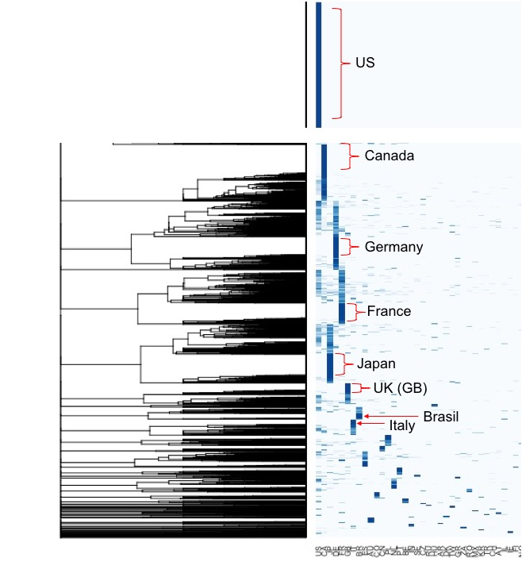
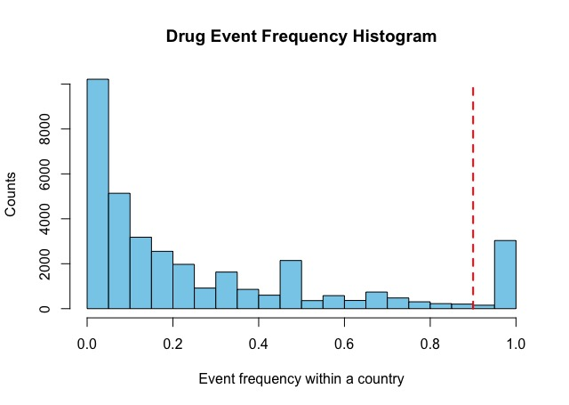

# openfda

Explore and analyze FDA Drug Adverse Event (FAERS) data

[FDA Drug Adverse Event Overview](https://open.fda.gov/apis/drug/event/)

[FDA Adverse Event Reporting System (FAERS) Quarterly Data Extract Files](https://fis.fda.gov/extensions/FPD-QDE-FAERS/FPD-QDE-FAERS.html)

[openFDA github repository](https://github.com/FDA/openfda/)

Component | Details
------------ | -------------
Question | Are different adverse events reported in different countries?
Sources (FAERS) | REAC19Q3.txt, DEMO19Q3.txt -> join on PRIMARYID
Data	   | for each case, record DEMO.OCCR_COUNTRY, REAC.PT pairs
Analyses | frequency of each event-type in each country (profile)
 .  | frequency profile comparisons across countries
 .  | distance matrices
 .  | classification/clustering

2-Way Heatmap of normalized event frequencies (countries in columns):

Zoomed-in on left side with distinct sets of events for top reporting countries: 

Histogram of counts of frequency values of each event in individual countries - a frequency cutoff of 0.9 seems reasonable.

"Distinct" drug event terms above frequency cutoff here:  

Possible further analyses:

Analysis | Methods
------------ | -------------
Clustering | K-means, Non-negative matrix factorization

